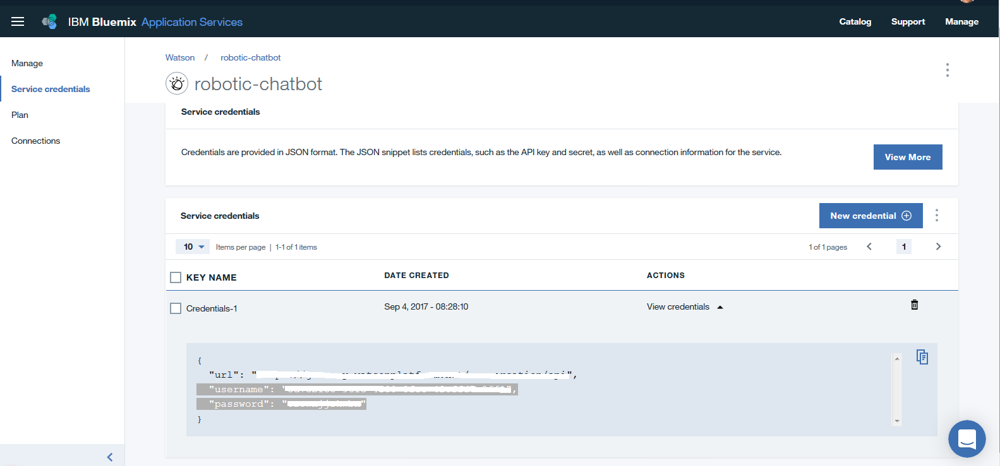

# Robotic Calculations and Inference Agent

> Watson Conversation is now Watson Assistant. Although some images in this code pattern may show the service as Watson Conversation, the steps and processes will still work.

There is a technological revolution taking place in the service industry with the introduction of Robots. The Robots are powered by artifical intelligence and are able to perform the roles of a waiter, customer relationship executive, cognitive assistant etc. The capabilities of the robot can be enhanced exponentially by integrating with cloud capabilities.

This code pattern demonstrates a scenario where the robot can answer queries on financial data by integrating with IBM Watson Assistant service and IBM Watson Studio. We will take you through the end to end flow of steps in building an interactive interface between [NAO](https://www.softbankrobotics.com/emea/en/nao) Robot, Watson Assistant API & Watson Studio.

When the reader has completed this code pattern, they will understand how to:

* Establish the communication between NAO Robot and IBM Watson Studio with Watson Assistant.
* Create the Watson Assistant chat bot application.
* Perform statistical analysis on a financial dataset using Jupitor (Python) Notebook on IBM Watson Studio.

The intended audience for this code pattern are developers who want to develop a complete analytics solution on Watson Studio with a custom web user interface. This code pattern can be extended for other use cases that integrate Watson Assistant and Watson Studio to enable exchange of information and process natural language along with mining the data to generate insights. For example:

* Sales assist: provide recommendations to onfield sales agent for insurance domain
* Retail Sector: Inventory planning
* Manufacturing Sector: Monitoring the systems
* Concierge: Travel and Hospitality

## Data set used

The data set used in this code pattern is [data/data.csv](data/data.csv) and originates from a [Watson Analytics](https://www.ibm.com/communities/analytics/watson-analytics-blog/retail-sales-marketing-profit-cost) blog post.

## Flow


1. The user asks the questions on the dataset to the NAO Robot.
2. The NAO Robot will convert the speech to text, and will send the text to Node-RED Flow for further processing on the cloud. The results from the processing on the cloud is returned to the NAO Robot through the Node-RED flow.
3. Node-RED flow sends the converted text to the Watson Assistant API.
4. The Watson Assistant API takes the text input. The text is analyzed to determine the intent based on the training provided.
5. The context and state of the conversation is saved to the Cloudant DB to track the conversation flow of the user.
6. The dataset for analysis is stored in the Object storage.
7. Data file is taken as input in csv format.
8. The Jupyter notebook receives the Watson Assistant Service API output from Node-RED using Web Sockets. The notebook processes the data based on the question and generates insights. The insights are sent back to the Node-RED flow using Web Socket.
9. The Jupyter notebook is powered by Spark.
10. The Node-RED flow sends the insights to NAO Robot.

## Included components

* [Nao-Robot Choregraphe Behaviour](https://www.softbankrobotics.com/emea/en/nao): The fruit of a unique combination of mechanical engineering and software, NAO is a character made up of a multitude of sensors, motors and software piloted by a made-to-measure operating system: NAOqi OS.

* [Node-RED](https://cloud.ibm.com/catalog/starters/node-red-starter): Node-RED is a programming tool for wiring together APIs and online services.

* [Watson Assistant](https://www.ibm.com/cloud/watson-assistant/): Build, test and deploy a bot or virtual agent across mobile devices, messaging platforms, or even on a physical robot.

* [IBM Watson Studio](https://www.ibm.com/cloud/watson-studio): Analyze data using RStudio, Jupyter, and Python in a configured, collaborative environment that includes IBM value-adds, such as managed Spark.

* [Jupyter Notebooks](http://jupyter.org/): An open-source web application that allows you to create and share documents that contain live code, equations, visualizations and explanatory text.

## Watch the Video

[](https://www.youtube.com/watch?v=BuwfbjC6t38)

## Steps

Follow these steps to setup and run this code pattern. The steps are
described in detail below.

1. [Sign up for IBM Cloud](#1-sign-up-for-ibm-cloud)
1. [Create IBM Cloud services](#2-create-ibm-cloud-services)
1. [Configure Watson Assistant Application](#3-configure-watson-assistant-application)
1. [View Watson Assistant Intents, Entities and Dialog](#4-view-watson-assistant-intents-entities-and-dialog)
1. [Import the Node-RED flow](#5-import-the-node-red-flow)
1. [Note the websocket URL](#6-note-the-websocket-url)
1. [Create a new Watson Studio project](#7-create-a-new-watson-studio-project)
1. [Create the notebook](#8-create-the-notebook)
1. [Add the data](#9-add-the-data)
1. [Update the notebook with service credentials](#10-update-the-notebook-to-read-the-data-as-dataframe)
1. [Run the notebook](#11-run-the-notebook)
1. [Results sent to the Node Red Flow](#12-results-sent-to-the-node-red-flow)
1. [Update the NAO Robot Choregraphe Behaviour with service credentials and Node-RED URL](#13-update-the-nao-robot-choregraphe-behaviour-with-service-credentials-and-node-red-url)
1. [Transfer the behaviour to NAO Robot](#14-transfer-the-behaviour-to-nao-robot)

### 1. Sign up for IBM Cloud

Sign up for IBM [**Cloud**](https://cloud.ibm.com/login). By clicking on create a free account you will get 30 days trial account.

### 2. Create IBM Cloud services

Create the IBM Cloud services by following the link to use the IBM Cloud UI.

* [**Node-RED Starter**](https://cloud.ibm.com/catalog/starters/node-red-starter)

  * Choose an appropriate name for the Node-RED application. Click on `Create`.

    

  * On the newly created Node-RED application page, Click on `Visit App URL` to launch the Node-RED editor once the application is in `Running` state.
  * On the `Welcome to your new Node-RED instance on IBM Cloud` screen, Click on `Next`
  * On the `Secure your Node-RED editor` screen, enter a username and password to secure the Node-RED editor and click on `Next`
  * On the `Browse available IBM Cloud nodes` screen, click on `Next`
  * On the `Finish the install` screen, click on Finish
  * Click on `Go to your Node-RED flow editor`

* [**Watson Speech to Text**](https://cloud.ibm.com/catalog/services/speech-to-text)

  * Choose an appropriate name for the Speech to Text service. Click on `Create`.

    

  * On the newly created Speech to Text Service page, Click on `Service credentials` then `View credential` and note down the credentials for future use.

    

* [**Watson Assistant Service**](https://cloud.ibm.com/catalog/services/conversation)

  * Choose an appropriate name for the Watson Assistant Service. Click on `Create`.

    

  * On the newly created Watson Assistant Service page, click on `Service credentials` then `View credential` and note down the credentials for future use.

    

  * On the same page, on the left side now click on `Manage` icon then on the right side click on `Launch tool` to launch start configuring Watson Assistant.

### 3. Configure Watson Assistant application

* Launch the **Watson Assistant** tool.

* Clone the repo locally. In a terminal, run:

  ```bash
  git clone https://github.com/IBM/watson-nao-robot
  ```

* Locate the file [workspace.json](conversation/workspace.json) locally.

* From the Watson Assistant tool, click on the `upload` icon to import a workspace.

  

* Click to choose a file, navigate to `workspace.json` document and select `Import`.

* Click on `Watson Assistant` at the top to go back to the workspace listing.

* Find the `Workspace ID` by clicking on the context menu (three vertical dots) of the new workspace and select `View details`.

  

* Click on the `View details`. Note down the `Workspace ID`.

### 4. View Watson Assistant Intents, Entities and Dialog

To view the conversation Intents, Entities and Dialog select the workspace and choose the `Intents` tab, `Entities` tab and `Dialog` tab.

***Intents***

Intents are purposes or goals expressed in a customer's input, such as answering a question or processing a bill payment. By recognizing the intent expressed in a customer's input, the Watson Assistant service can choose the correct dialog flow for responding to it.


***Entities***

Entities represent a class of object or a data type that is relevant to a user's purpose. By recognizing the entities that are mentioned in the user's input, the Watson Assistant service can choose the specific actions to take to fulfill an intent.

There are two types of the entities available under the Watson Assistant. One is `My entities` and another is `System entities`. Refer below for `My Entities`.


In this conversation two system entities have been used namely `@sys-date` and `@sys-number`. User has to `switch on` the button before using it.


***Dialog***

The dialog uses the intents and entities that are identified in the user's input, plus context from the application, to interact with the user and ultimately provide a useful response.


In this conversation, the slots feature under dialog has been used to gather multiple informations from the user. Slots for `Max` dialog is represented in the above image.

### 5. Import the Node-RED flow

* From the cloned repo navigate to the [node-red-flow](https://github.com/IBM/watson-nao-robot/blob/master/node-red-flow)  folder.
* Open the `NODERED_BASED_URL` and click on `Go To Your Node-RED flow editor` to launch the Node-RED editor.
* Import both Node-RED flows into the editor in two separate Node-RED instances.
* Update the Node-RED URL (replace `NODERED_BASE_URL` with the correct URL in the first_flow.json) under path in the json file.
* Open the `first_flow.json` file with a text editor and copy all the contents to Clipboard in the first instance of Node-RED app.
* In the second instance of Node-RED app, open the `second_flow.json` file with a text editor and copy all the contents to Clipboard.
* On the Node-RED flow editor for both flows, click the Menu and select `Import` -> `Clipboard`, select new flow and paste the contents from text editor & click `Import`.
* Components of Node-RED flow includes a web socket server, Watson Assistant Service, Watson Studio & user defined functions which tie them together to enable exchange of information.
* Please review steps 1 to 10 under the Architecture diagram to understand the flow of events using Node-RED.

  

#### Configure Watson Assistant credentials in Node-RED

* Double click on the `conversation` node. `Edit conversation node` prompt will open.

* Enter the `Workspace ID` that we noted in [Configure Watson Assistant Application](#3-configure-watson-conversation-application).

* If the service credentials from IBM Watson Assistant are username/password based as shown in the diagram below

  

* Add username & password from Watson Assistant as shown below & click `Done`.

  

* If the service credentials from IBM Watson Assistant are IAM based as shown below in the diagram

  

* Add the API key, Workspace ID as shown below and click `Done`

  

#### Deploy the Node-RED flows by clicking on the `Deploy` button

> *First flow*
> 

> *Second flow*
> 

### 6. Note the websocket URL

The websocket URL is `ws://`<NODERED_BASE_URL>`/ws/orchestrate`  where the `NODERED_BASE_URL` is the marked portion of the URL in the above image.

> **Note**: An example websocket URL for a Node-RED app with name `myApp` - `ws://myApp.mybluemix.net/ws/orchestrate` where `myApp.mybluemix.net` is the `NODERED_BASE_URL`.
The `NODERED_BASE_URL` can have an additional region information say `eu-gb` for UK region and `NODERED_BASE_URL` could be `myApp.eu-gb.mybluemix.net`.

### 7. Create a new Watson Studio project

* Sign up or log into IBM's [Watson Studio](https://dataplatform.cloud.ibm.com). Once in, you'll land on the dashboard.

* Create a new project by clicking `+ New project` and choosing `Data Science`:

  

* Enter a name for the project name and click `Create`.

* **NOTE**: By creating a project in Watson Studio a free tier `Object Storage` service and `Watson Machine Learning` service will be created in your IBM Cloud account. Select the `Free` storage type to avoid fees.

  

* Upon a successful project creation, you are taken to a dashboard view of your project. Take note of the `Assets` and `Settings` tabs, we'll be using them to associate our project with any external assets (datasets and notebooks) and any IBM cloud services.

  

### 8. Create the notebook

* From the new project `Overview` panel, click `+ Add to project` on the top right and choose the `Notebook` asset type.

  

* Fill in the following information:

  * Select the `From URL` tab. [1]
  * Enter a `Name` for the notebook and optionally a description. [2]
  * Under `Notebook URL` provide the following url: [https://github.com/IBM/watson-nao-robot/blob/master/notebook/robo_notebook.ipynb](https://github.com/IBM/watson-nao-robot/blob/master/notebook/robo_notebook.ipynb) [3]
  * For `Runtime` select the `Python 3.5` option. [4]

  

* Click the `Create` button.

* **TIP:** Once successfully imported, the notebook should appear in the `Notebooks` section of the `Assets` tab.

### 9. Add the data

* This notebook uses the dataset [data.csv](data/data.csv). We need to load this assets to our project.

* From the new project `Overview` panel, click `+ Add to project` on the top right and choose the `Data` asset type.

   

* A panel on the right of the screen will appear to assit you in uploading data. Follow the numbered steps in the image below.

  * Ensure you're on the `Load` tab. [1]
  * Click on the `browse` option. From your machine, browse to the location of the `data.csv` file in this repository, and upload it. [not numbered]
  * Once uploaded, go to the `Files` tab. [2]
  * Ensure the files appear. [3]

   

### 10. Update the notebook to read the data as DataFrame

Launchh the notebook and select the cell below `2. Read the Data & convert it into Dataframe` section in the notebook.

Use `Find and Add Data` (look for the `10/01` icon) and its `Files` tab. You should see the file names uploaded earlier. Make sure your active cell is the empty one created earlier. Select `Insert to code` (below your file name). Click `Insert pandas DataFrame` from drop down menu.


#### Update the websocket URL in the notebook

In the cell below `7. Expose integration point with a websocket client`, update the websocket url noted in [section 5](#5-note-the-websocket-url) in the `start_websocket_listener` function.


### 11. Run the notebook

When a notebook is executed, what is actually happening is that each code cell in
the notebook is executed, in order, from top to bottom.

Each code cell is selectable and is preceded by a tag in the left margin. The tag
format is `In [x]:`. Depending on the state of the notebook, the `x` can be:

* A blank, this indicates that the cell has never been executed.
* A number, this number represents the relative order this code step was executed.
* A `*`, this indicates that the cell is currently executing.

* Click the `(►) Run` button to start stepping through the notebook.

### 12. Results Sent To The Node-Red Flow

The results from Watson Studio are sent to Node-RED based URL which is relayed to NAO Robot. The response time for the answer to the question is approximately 8 seconds.

Let's see a few sample responses:

> **User**: What is the highest profit of Capri Italy in 2007?
>
> **NAO**: The highest profit of Capri Italy in 2007 is 120,000.


### 13. Update the NAO Robot Choregraphe Behaviour with service credentials and Node-RED URL

> **NOTE**: Choregraphe works only with Python 2x. Please use Python 2x for Choregraphe service.

Open the NAO robot project [`WatsonNaoRobot.pml`](choregraphe/watson_nao_robot/WatsonNaoRobot.pml). Connect to the NAO robot using the `Connection` -> `Connect` menu from Choregraphe.

#### Update Watson Speech to Text credentials in the Behavior

* Select the [`behavior.xar`](choregraphe/watson_nao_robot/WatsonSTT/behavior.xar) file in the project folder structure in the top left pane.
* Double click the `WatsonSTT Python Script` box in the choregraphe canvas pane.
* Update the Watson Speech to Text credentials in the `auth` variable in the Python code inside the `Python Script` box as shown below.


#### Update Node-RED URL in the Behaviour

* Select the behavior.xar file in the project folder structure in the top left pane.
* Double click the `PostToNode-RED Python Script` box in the choregraphe canvas pane.
* Update the Node-RED URL in the `url` variable in the Python code inside the `Python Script` box as shown below.


### 14. Transfer the behaviour to NAO Robot

Save the changes to the NAO robot project (WatsonNaoRobot.pml).

* Select `Connection` from Choregraphe Menu and click `Upload to the robot and Play` sub menu to transfer behavior files to the NAO Robot and activate this code on the Robot.
* Press the front tactile head sensor of the NAO robot and ask your question related to the dataset analysis and insights.


## Troubleshooting

[See DEBUGGING.md.](DEBUGGING.md)

## License

This code pattern is licensed under the Apache Software License, Version 2.  Separate third party code objects invoked within this code pattern are licensed by their respective providers pursuant to their own separate licenses. Contributions are subject to the [Developer Certificate of Origin, Version 1.1 (DCO)](https://developercertificate.org/) and the [Apache Software License, Version 2](http://www.apache.org/licenses/LICENSE-2.0.txt).

[Apache Software License (ASL) FAQ](http://www.apache.org/foundation/license-faq.html#WhatDoesItMEAN)
