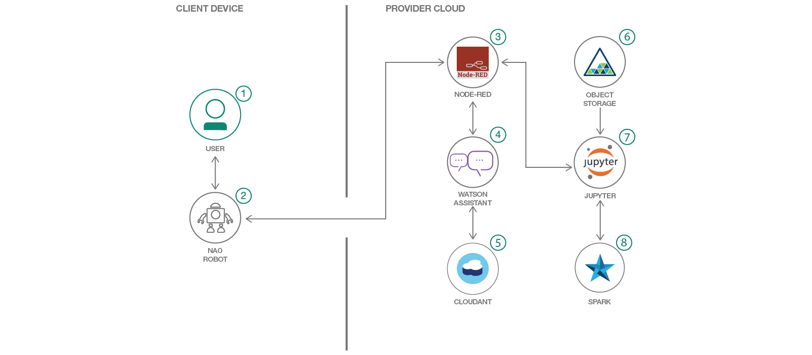

# watson-nao-robot

This journey takes you through end to end flow of steps in building an interactive interface between NAO Robot and Watson Conversation API. Nao Robot listen the vocal query and converts it into text and sends it to Node Red Flow. The Node Red Flow uses Watson Conversation API to break and map the text into intents and entities for which it has been trained already. The conversation API through Node Red Flow further linked to a Jupyter Notebook in Data Science Experience(DSX). In this notebook statistical analysis is performed on the finantial data set. The result of the query is now again sent back to Node Red Flow. Which is transfered to Nao Robo and it speaks the result.

