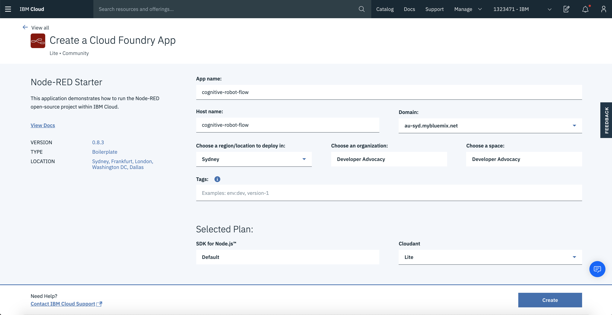
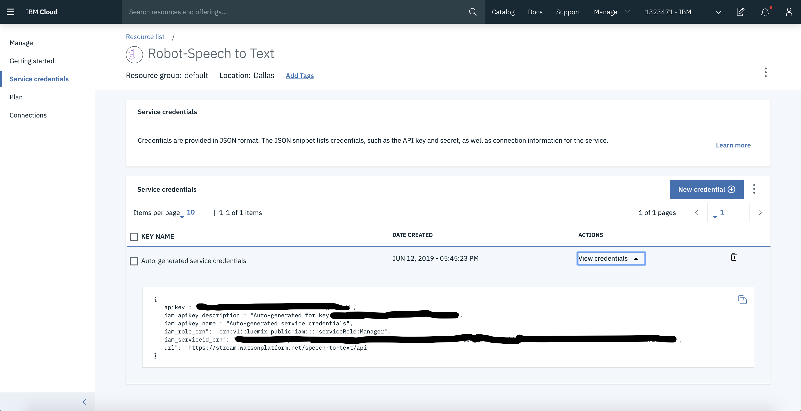
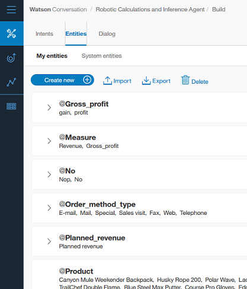
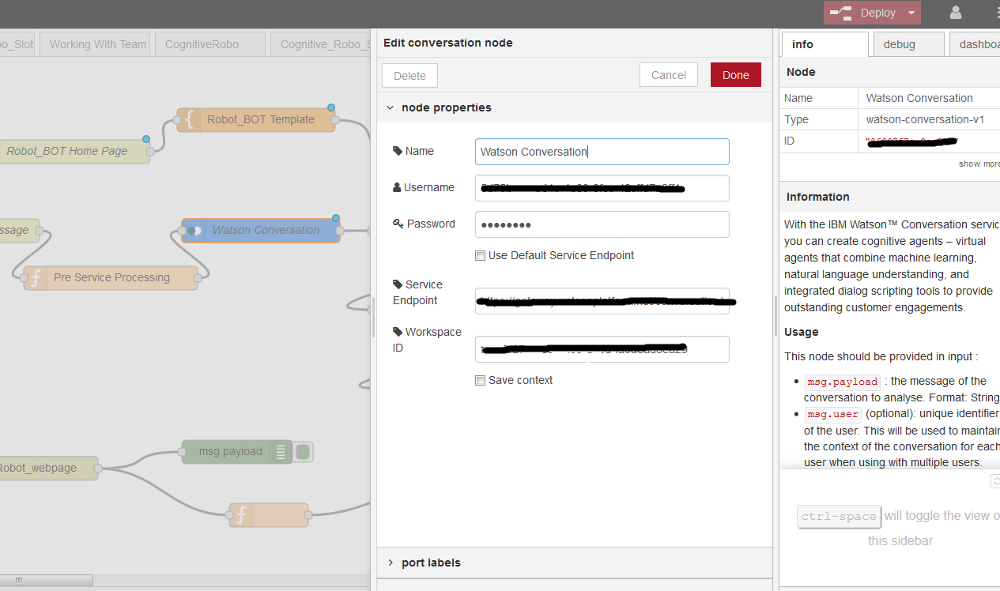
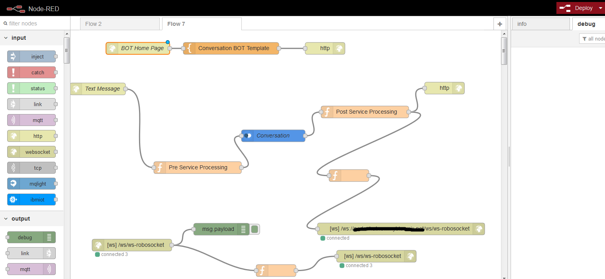
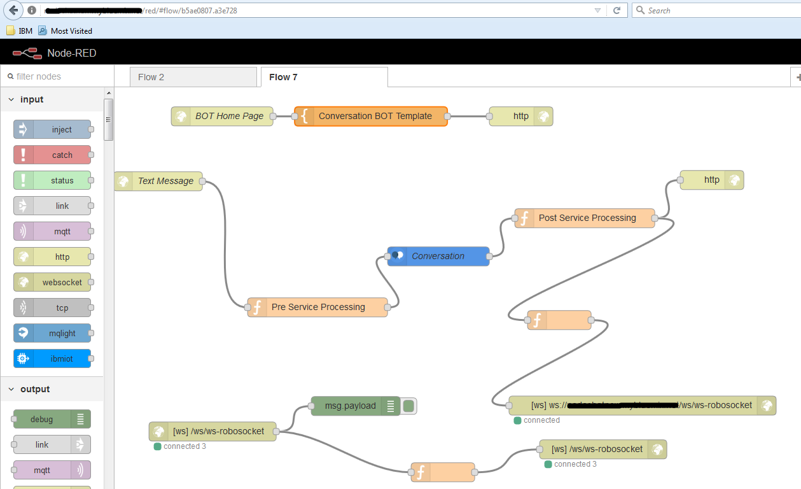
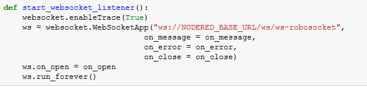

# Robotic Calculations and Inference Agent

There is a technological revolution taking place in the service industry with the introduction of Robots. The Robots are powered by artifical intelligence and are able to perform the roles of a waiter, customer relationship executive, cognitive assistant etc. The capabilties of the robot can be enhanced exponentially by integrating with cloud capabilities. 

This journey demonstrates a scenario where the robot can answer queries on financial data by integrating with IBM Conversation service and IBM Data Science Experience (DSX). We will take you through the end to end flow of steps in building an interactive interface between [NAO](https://www.ald.softbankrobotics.com/en/robots/nao/find-out-more-about-nao) Robot, Watson Conversation API & Data Science Experience. 

When the reader has completed this journey, they will understand how to:

* Establish the communication between NAO Robot and IBM Data Science Experience with Watson Conversation.
* Create the Watson Conversation chat bot application.
* Perform statistical analysis on a financial dataset using Jupitor (Python) Notebook on IBM Data Science Experience.

The intended audience for this journey are developers who want to develop a complete analytics solution on DSX with a custom web user interface. 

1. The user asks the questions on the dataset to the NAO Robot.
2. The NAO Robot will convert the speech to text, and will send the text to Node-RED Flow for further processing on the cloud. The results from the processing on the cloud is returned to the NAO Robot through the Node-RED flow.
3. Node-RED flow sends the converted text to the Watson Conversation API. 
4. The Watson Conversation API takes the text input. The text is analyzed to determine the intent based on the training provided.
5. The context and state of the conversation is saved to the Cloudant DB to track the conversation flow of the user.
6. The dataset for analysis is stored in the Object storage.
7. Data file is taken as input in csv format.
8. The Jupyter notebook receives the Watson Conversation Service API output from Node-RED using Web Sockets. The notebook processes the data based on the question and generates insights. The insights are sent back to the Node-RED flow using Web Socket.
9. The Jupyter notebook is powered by Spark.
10. The Node-RED flow sends the insights to NAO Robot.

## Included components

* [Nao-Robot Choregraphe Behaviour](https://www.ald.softbankrobotics.com/en/robots/nao/find-out-more-about-nao): The fruit of a unique combination of mechanical engineering and software, NAO is a character made up of a multitude of sensors, motors and software piloted by a made-to-measure operating system: NAOqi OS.

* [Node-RED](https://console.bluemix.net/catalog/starters/node-red-starter): Node-RED is a programming tool for wiring together APIs and online services.

* [Watson-Conversation-API](https://www.ibm.com/watson/services/conversation/?cm_sp=IBMCode-_-create-cognitive-retail-chatbot-_-included_components-_-watson-conversation): Build, test and deploy a bot or virtual agent across mobile devices, messaging platforms, or even on a physical robot.

* [IBM Data Science Experience](https://apsportal.ibm.com/analytics): Analyze data using RStudio, Jupyter, and Python in a configured, collaborative environment that includes IBM value-adds, such as managed Spark.

* [Bluemix Object Storage](https://console.ng.bluemix.net/catalog/services/object-storage/?cm_sp=dw-bluemix-_-code-_-devcenter): A Bluemix service that provides an unstructured cloud data store to build and deliver cost effective apps and services with high reliability and fast speed to market.

* [Jupyter Notebooks](http://jupyter.org/): An open-source web application that allows you to create and share documents that contain live code, equations, visualizations and explanatory text.

## Featured technologies

* [Data Science](https://developer.ibm.com/code/technologies/data-science/): Systems and scientific methods to analyze structured and unstructured data in order to extract knowledge and insights.
* [Analytics](https://developer.ibm.com/code/technologies/analytics/): Analytics delivers the value of data for the enterprise.
* [Python](https://www.python.org/): Python is a programming language that lets you work more quickly and integrate your systems more effectively.
* [Jupyter Notebooks](http://jupyter.org/): An open-source web application that allows you to create and share documents that contain live code, equations, visualizations and explanatory text.

# Watch the Video

# Steps

Follow these steps to setup and run this developer journey. The steps are
described in detail below.

1. [Sign up for IBM Bluemix](#1-sign-up-for-ibm-bluemix)
1. [Create Bluemix services](#2-create-bluemix-services)
1. [Configure Watson Conversation Application](#3-configure-watson-conversation-application)
1. [View Conversation Intents, Entities and Dialog](#4-view-conversation-intents-entities-and-dialog)
1. [Import the Node-RED flow](#5-import-the-node-red-flow)
1. [Note the websocket URL](#6-note-the-websocket-url)
1. [Sign up for Data Science Experience](#7-sign-up-for-data-science-experience)
1. [Create the notebook](#8-create-the-notebook)
1. [Add the data](#9-add-the-data)
1. [Update the notebook with service credentials](#10-update-the-notebook-with-service-credentials)
1. [Run the notebook](#11-run-the-notebook)
1. [Results sent to the Node Red Flow](#12-results-sent-to-the-node-red-flow)
1. [Update the NAO Robot Choregraphe Behaviour with service credentials and Node-RED URL](#13-update-the-nao-robot-choregraphe-behaviour-with-service-credentials-and-node-red-url)
1. [Transfer the behaviour to NAO Robot](#14-transfer-the-behaviour-to-nao-robot)

## 1. Sign up for IBM Bluemix

Sign up for IBM [**Bluemix**](https://console.bluemix.net/). By clicking on create a free account you will get 30 days trial account.

## 2. Create Bluemix services

Create the Bluemix services by following the link to use the Bluemix UI. 

[**Node-RED Starter**](https://console.bluemix.net/catalog/starters/node-red-starter)
  
  Choose an appropriate name for the Node-RED application - `App name:`. Click on `Create`.
  
  
  
  * On the newly created Node-RED application page, Click on `Visit App URL` to launch the Node-RED editor once the application is in `Running` state.
  * On the `Welcome to your new Node-RED instance on IBM Bluemix` screen, Click on `Next`
  * On the `Secure your Node-RED editor` screen, enter a username and password to secure the Node-RED editor and click on `Next`
  * On the `Browse available IBM Bluemix nodes` screen, click on `Next`
  * On the `Finish the install` screen, click on Finish
  * Click on `Go to your Node-RED flow editor`  

[**Watson Speech to Text Service**](https://console.bluemix.net/catalog/services/speech-to-text)
  
  Choose an appropriate name for the Speech to Text Service - `App name:`. Click on `Create`.

  

  * On the newly created Speech to Text Service page, Click on `Service credentials` then `View credential` and note down the credentials for future use.

  

[**Watson Conversation Service**](https://console.bluemix.net/catalog/services/conversation)
  
  Choose an appropriate name for the Conversation Service - `App name:`. Click on `Create`.

  

* On the newly created Conversation Service page, click on `Service credentials` then `View credential` and note down the credentials for future use.

  

* On the same page, on the left side now click on `Manage` icon then on the right side click on `Launch tool` to launch the   Conversation Workspaces. 

## 3. Configure Watson Conversation Application

Launch the **Watson Conversation** tool. 
* [Clone this repo](https://github.com/IBM/watson-nao-robot).

* Navigate to [workspace.json](https://github.com/IBM/watson-nao-robot/blob/master/conversation/workspace.json).

* Click on the "up arrow" to import a workspace & make sure `Everything` option is selected.

  

* Click to choose a file, navigate to `workspace.json` document and select `Import`

* Click on `Watson Conversation` at the top to go back to workspace

* Find the `Workspace ID` by clicking on the context menu (three vertical dots) of the new
workspace and select `View details`. 

  

* Click on the `View details`. Note down the `Workspace ID`.

  

## 4. View Conversation Intents, Entities and Dialog
To view the conversation Intents, Entities and Dialog select the workspace and choose the `Intents` tab, `Entities` tab and `Dialog` tab.

***Intents***

Intents are purposes or goals expressed in a customer's input, such as answering a question or processing a bill payment. By recognizing the intent expressed in a customer's input, the Conversation service can choose the correct dialog flow for responding to it.

***Entities***

Entities represent a class of object or a data type that is relevant to a user's purpose. By recognizing the entities that are mentioned in the user's input, the Conversation service can choose the specific actions to take to fulfill an intent.

There are two types of the entities available under the Watson Conversation. One is `My entities` and another is `System entities`. Refer below for `My Entities`. 

In this conversation two system entities have been used namely `@sys-date` and `@sys-number`. User has to `switch on` the button before using it.

***Dialog***

The dialog uses the intents and entities that are identified in the user's input, plus context from the application, to interact with the user and ultimately provide a useful response.

In this conversation, the slots feature under dialog has been used to gather multiple informations from the user. Slots for `Max` dialog is represented in the above image. 

## 5. Import the Node-RED flow

* [Clone this repo](https://github.com/IBM/watson-nao-robot).
* Navigate to [Robotic_AI_Agent_workflow.json](https://github.com/IBM/watson-nao-robot/blob/master/node-red-flow/Robotic_AI_Agent_workflow.json).
* Open the `NODERED_BASED_URL` and click on `Go To Your Node-RED flow editor` to launch the Node-RED editor.
* Update the Node-RED URL (replace `NODERED_BASE_URL` with the correct URL) under path in the json file. 
* Open the `Robotic_AI_Agent_workflow.json` file with a text editor and copy all the contents to Clipboard. 
* On the Node-RED flow editor, click the Menu and select `Import` -> `Clipboard`, select new flow and paste the contents from text editor & click `Import`.
* Components of Node-RED flow includes a web socket server, Watson Conversation Service, Data Science Experience & user defined functions which tie them together to enable exchange of information.
* Please review steps 1 to 10 under the Architecture diagram to understand the flow of events using Node-RED. 

 
  
  
 
 #### Configure the Conversation API Credentials
* Double click on the `conversation` node. `Edit conversation node` prompt will open.
* Enter the `Workspace ID` that we noted in [Configure Watson Conversation Application](#3-configure-watson-conversation-application).
* Add username & password from Watson Conversation & click `Done`.

 #### Deploy the Node-RED flow by clicking on the `Deploy` button

## 6. Note the websocket URL

The websocket URL is `ws://`<NODERED_BASE_URL>`/ws/Robot_webpage`  where the `NODERED_BASE_URL` is the marked portion of the URL in the above image.
### Note:
An example websocket URL for a Node-RED app with name `myApp` - `ws://myApp.mybluemix.net/ws/ws-robosocket` where `myApp.mybluemix.net` is the `NODERED_BASE_URL`. 
The `NODERED_BASE_URL` can have an additional region information say `eu-gb` for UK region and `NODERED_BASE_URL` could be `myApp.eu-gb.mybluemix.net`. 

## 7. Sign up for Data Science Experience

[**Data Science Experience**](https://datascience.ibm.com/). By signing up for Data Science Experience, two services: ``DSX-Spark`` and ``DSX-ObjectStore`` will be created in your Bluemix account.

## 8. Create the notebook

Open IBM Data Science Experience. Use the menu on the top to select `Projects` and then `Default Project`.
Click on `Add notebooks` (upper right) to create a notebook.

* Select the `From URL` tab.
* Enter a name for the notebook.
* Optionally, enter a description for the notebook.
* Enter this Notebook URL: https://github.com/IBM/watson-nao-robot/blob/master/Notebook/Robo_Notebook.ipynb
* Click the `Create Notebook` button.

## 9. Add the data 

#### Add the data to the notebook
Use `Find and Add Data` (look for the `10/01` icon)
and its `Files` tab. From there you can click
`browse` and add data files from your computer.

> Note: The data file in the `data` directory - `Data.csv` has been downloaded from https://www.ibm.com/communities/analytics/watson-analytics-blog/retail-sales-marketing-profit-cost/. Change the file name from `WA_Retail-SalesMarketing_-ProfitCost.csv` to `Data.csv` before reading it in DSX. There are spaces in the column names which needs to be replaced with "_" before reading the file in DSX. Ex :- Product line has to be Product_line.
Please visit the site for the terms and conditions for usage of the data.

  

## 10. Update the notebook with service credentials

#### Add the Object Storage credentials to the notebook
Select the cell below `2.1 Add your service credentials for Object Storage` section in the notebook to update
the credentials for Object Store. 

Use `Find and Add Data` (look for the `10/01` icon) and its `Files` tab. You should see the file names uploaded earlier. Make sure your active cell is the empty one created earlier. Select `Insert to code` (below your file name). Click `Insert Crendentials` from drop down menu.

 

#### Update the websocket URL in the notebook
In the cell below `7. Expose integration point with a websocket client` , update the websocket url noted in [section 5](#5-note-the-websocket-url) in the `start_websocket_listener` function.

## 11. Run the notebook

When a notebook is executed, what is actually happening is that each code cell in
the notebook is executed, in order, from top to bottom.

Each code cell is selectable and is preceded by a tag in the left margin. The tag
format is `In [x]:`. Depending on the state of the notebook, the `x` can be:

* A blank, this indicates that the cell has never been executed.
* A number, this number represents the relative order this code step was executed.
* A `*`, this indicates that the cell is currently executing.

There are several ways to execute the code cells in your notebook:

* One cell at a time.
  * Select the cell, and then press the `Play` button in the toolbar.
* Batch mode, in sequential order.
  * From the `Cell` menu bar, there are several options available. For example, you
    can `Run All` cells in your notebook, or you can `Run All Below`, that will
    start executing from the first cell under the currently selected cell, and then
    continue executing all cells that follow.

## 12. Results Sent To The Node-Red Flow
   
   The results from Data Science Experience are sent to Node-RED flow which is relayed to NAO Robot. 
   
   The sample response for the question is given below.

      **User**: What is the highest profit of Capri Italy in 2007?
   
      **NAO response**: The highest profit of Capri Italy in 2007 is 310000.

## 13. Update the NAO Robot Choregraphe Behaviour with service credentials and Node-RED URL
 
Open the NAO robot project (`WatsonNaoRobot.pml`) file under `choregraphe/watson_nao_robot` folder with the Choregraphe.
Connect to the NAO robot using the `Connection/Connect` to menu from Choregraphe.

#### Update Watson Speech to Text credentials in the Behavior
* Select the `behavior.xar` file in the project folder structure in the top left pane. 
* Double click the `WatsonSTT Python Script` box in the choregraphe canvas pane. 
* Update the Watson Speech to Text credentials in the `auth` variable in the Python code inside the `Python Script` box as shown below.

 

#### Update Node-RED URL in the Behaviour
* Select the behavior.xar file in the project folder structure in the top left pane. 
* Double click the `PostToNode-RED Python Script` box in the choregraphe canvas pane. 
* Update the Node-RED URL in the `url` variable in the Python code inside the `Python Script` box as shown below.

 

## 14. Transfer the behaviour to NAO Robot

Save the changes to the NAO robot project (WatsonNaoRobot.pml).

* Select `Connection` from Choregraphe Menu and click `Upload to the robot and Play` sub menu to transfer behavior files to the NAO Robot and activate this journey code on the Robot.
* Press the front tactile head sensor of the NAO robot and ask your question related to the dataset analysis and insights. 

# Troubleshooting

[See DEBUGGING.md.](DEBUGGING.md)

# License

[Apache 2.0](LICENSE)
